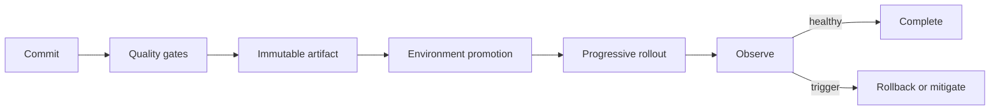

# Operations architecture

Delivery uses immutable artifacts promoted across explicit environments. Configuration
and secrets remain external to artifacts. Every production change needs observable
health signals, a bounded rollout, a rollback trigger, an owner, and human authority.

CI verifies; CD prepares and executes only under the repository's authorization model.
