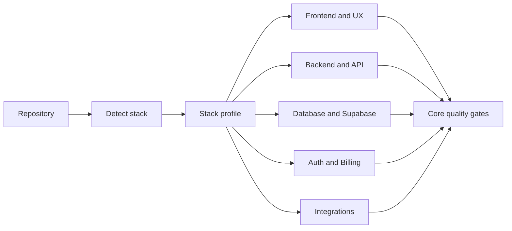

# Product engineering architecture

Part 2 begins with evidence, not a presumed stack. `detect-stack.sh` reports only
signals found in the target repository. The Stack Analyst converts those signals
into a reviewed profile; specialists are activated from that profile and the
requested change.

Specialists activate only for touched surfaces. The primary implementer owns the
change; specialists define domain constraints and review evidence.
