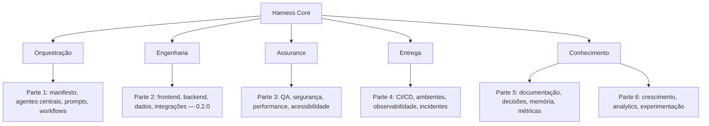
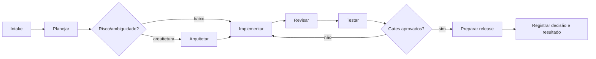

# Mapa modular do sistema completo

## Fluxo operacional

## Contratos entre módulos

Cada workflow declara entradas, etapas, gates e saídas. Cada agente define
responsabilidade, limites e formato de handoff. Prompts coletam contexto;
checklists verificam evidências. O manifesto lista os componentes publicáveis.

## Partes planejadas

| Parte | Escopo | Saída principal |
|---|---|---|
| 1 | Fundação e núcleo | Harness portátil e validado |
| 2 | Domínios de produto | Agentes e padrões de implementação |
| 3 | Qualidade avançada | Gates e matrizes de risco |
| 4 | Operação | Pipelines e runbooks |
| 5 | Conhecimento | ADRs, memória e governança |
| 6 | Produto e growth | Métricas e experimentação |
| 7 | Integrações | Adaptadores Hermes/MCP/serviços |
| 8 | Avaliação | Evals, benchmarks e maturidade |

All eight parts are delivered in version 1.0.0.
